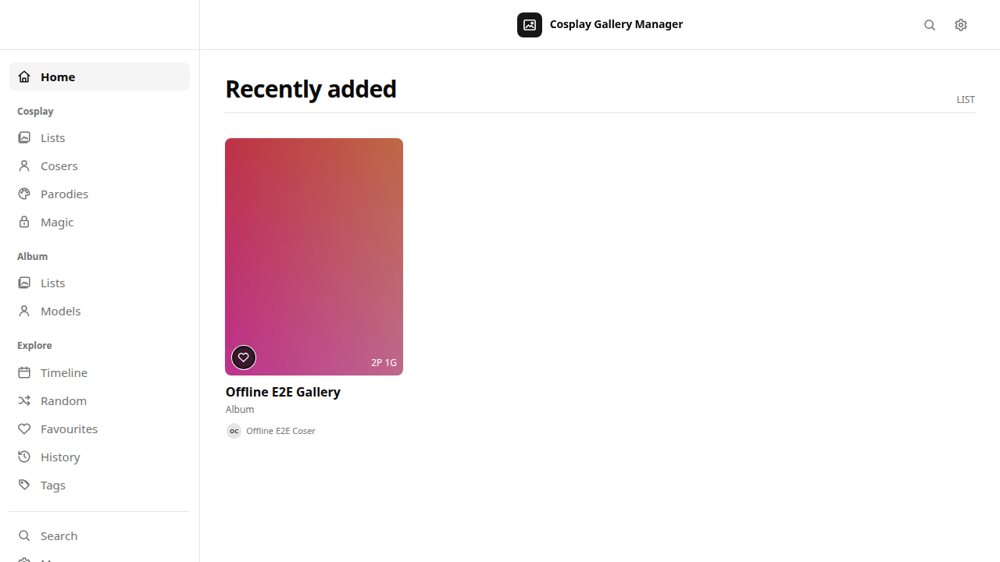

# Cosplay Gallery Manager

Cosplay Gallery Manager（CGM）是一个本地优先、单所有者、自托管的 Cosplay 与写真作品集管理系统。它以 **Gallery** 为业务聚合根，把一个媒体目录或 ZIP/CBZ、TAR、TAR.GZ/TGZ、7Z 归档作为一个完整作品集进行发现、整理、浏览、备份和元数据同步。

> [!WARNING]
> 当前代码处于 `1.5.0-dev` 本机业务迭代阶段，尚未发布正式稳定版。第一版以 Linux 原生部署和 Linux 容器为目标；Windows 与 macOS 原生构建已经延期，不属于当前支持范围。



## 项目定位

CGM 面向以文件夹或归档保存 Cosplay、写真和 Album 的个人媒体库。它不把图片、视频视为互不关联的散文件，而是围绕 Gallery 保存来源身份、成员顺序、Coser、作品来源、角色、Tag、个人状态和可移植 Manifest。

典型业务流程如下：

```text
配置媒体库与识别规则
  → 发现 Gallery 候选
  → 人工审阅并导入 DRAFT
  → 原子扫描媒体成员
  → 补充关系、分级和展示项
  → 激活并在 Browse 中使用
  → 按需同步 Manifest、备份或恢复
```

## 主要功能

### Gallery 发现与扫描

- 支持 `DIRECTORY`、ZIP 和 CBZ 单一来源；一个 Gallery 最多绑定一个物理来源。
- 按确定顺序识别既有来源、有效 `.cosplay.json`、空 `.cosplay-root` 标记和人工配置的路径规则。
- 采用“发现候选 → 导入 DRAFT → 显式扫描”的两阶段流程，不会因配置媒体根而自动导入全部内容。
- DIRECTORY 扫描拒绝根符号链接且永不跟随内部符号链接；归档经过路径穿越、加密、条目数、容量和压缩比限制。
- 重扫使用 staging 和原子提交；来源暂时失联不会被误判为用户删除成员。

### 元数据与关系

- 核心实体包括 Gallery、Coser、Work、Character 和 Tag；全部使用可移植 UUID、永久 Alias 与 Tombstone 保护身份。
- Gallery 可设置 Credit、Cast、Character、Work、Tag、内容分级、封面、拍摄时间、外部链接和个人状态。
- Gallery 类型不单独存储：存在 Cast 时派生为 `COSPLAY`，无 Cast 时派生为 `ALBUM`。
- Coser 支持资料、头像、Banner、社交账号和独立 Coser Manifest；头像与 Banner 由 CGM 托管，不写入媒体来源。
- Gallery Manifest 使用 `.cosplay.json`：目录来源写入根目录，归档来源写入相邻的 `<完整归档名>.cosplay.json`，不会重打包归档。
- Manifest Push、Pull 和逐字段冲突处理均为显式操作，不会后台静默覆盖数据库或文件。

### 浏览与媒体

- Browse 采用 Cosplay 与 Album 双分区：Cosplay 提供 Lists、Cosers、Parodies、Magic，Album 提供 Lists、Models。
- 同一人物继续使用同一个 Coser 身份，可根据实际 Gallery 类型出现在 Coser、Model 或两个视图中。
- 提供 Gallery/Coser/Model/Work/Character 详情、搜索、时间线、随机浏览、收藏、评分、历史和 Tag 导航。
- 支持静态图片、动画图片、常见 RAW 和视频处理；内容类型由实际文件内容判定，不只信任扩展名。
- 每个静态图片预生成不可回收的 `CARD_480` 基础缩略图；Lightbox 4096 大图按首次查看生成，并可依据容量上限执行 LRU 回收。
- 浏览器只读取经过认证的不透明资源 URL，不直接暴露媒体绝对路径或缓存路径。

### 管理、备份与恢复

- 单密码所有者模型，Session、同源校验、敏感操作重新认证和精确确认词共同保护管理操作。
- 媒体处理任务使用 SQLite 持久化队列、租约与恢复机制；进程异常退出后不会把内存状态当成业务事实。
- 默认每日执行 SQLite 一致性快照；完整备份包含产品数据库、托管 Coser 元数据、必要启动配置和版本清单。
- 恢复前验证 SHA-256、产品身份、版本清单和安全 ZIP 约束，并自动创建安全备份；异机恢复要求逐个映射或禁用媒体库路径。
- 管理日志使用稳定事件码、请求 ID 和技术状态，不记录 GraphQL 变量、搜索词、媒体路径或业务元数据。

## 明确不包含的能力

第一版不会提供：

- 网络 Scraper、在线元数据识别、StashBox 接入或主动联网抓取；
- 插件市场、运行时脚本、旧 Stash 主题或在线更新器；
- 删除、移动或改写原始媒体的产品 API；
- 多用户权限系统、多个 CGM 实例并发访问同一数据库；
- 公网直接暴露、内置 TLS、原生移动客户端或 GPU 媒体处理；
- Windows/macOS 原生发行包。

CGM 可以在所有者明确执行 Manifest Push 时写入 sidecar 文件。除此之外，来源媒体应优先以只读权限挂载。

## 平台状态

| 目标 | 当前状态 |
| --- | --- |
| Linux amd64 原生 | 已构建并完成本机业务部署验证 |
| Linux arm64 原生 | 构建通过，仍需真实 arm64 设备验收 |
| Docker linux/amd64 | 已构建、以非 root 用户启动并通过健康检查 |
| Docker linux/arm64 | 构建目标已定义，仍需 arm64 runner 完成运行验收 |
| Windows/macOS 原生 | 第一版延期，不支持 |

当前 Chromium 离线业务流程和 1440/390px 视口已纳入自动化门禁；Firefox、WebKit、Edge、真实移动设备和读屏仍属于待完成的目标环境验收。最新状态以[实施状态](docs/development/IMPLEMENTATION_STATUS.md)为准。

## 从源码构建

### 环境要求

- Linux amd64 或 arm64；
- Go `1.25.x`（当前验证工具链为 `1.25.12`）；
- Node.js `20.19+` 与 Corepack；
- 支持 CGO 的 C 编译器和 `make`；
- 视频处理需要 FFmpeg/FFprobe；RAW 处理需要兼容 LibRaw 的 `dcraw`。

```bash
git clone https://github.com/Rainbow-Runner/Cosplay-Gallery-Manager.git
cd Cosplay-Gallery-Manager/ui/web
corepack pnpm install --frozen-lockfile
cd ../..
make build-cgm CGM_GO="$(command -v go)" CGM_OUTPUT=./cgm
./cgm -version
```

`build-cgm` 会先检查新旧 UI 依赖边界、构建 React 19 前端，再生成嵌入全部前端资源的 CGM 单文件二进制。不要使用原 Stash 的 `stash` 构建目标作为 CGM 产品包。

## 原生快速启动

创建只允许当前服务用户访问的数据库、缓存、Coser 元数据和备份目录。媒体目录可以且建议只读。示例 `cgm.json`：

```json
{
  "listen": "127.0.0.1:9999",
  "database_path": "/var/lib/cgm/product.sqlite",
  "cache_path": "/var/cache/cgm",
  "ffmpeg_path": "/usr/bin/ffmpeg",
  "ffprobe_path": "/usr/bin/ffprobe",
  "libraw_path": "/usr/bin/dcraw",
  "worker_count": 2,
  "log_level": "INFO",
  "metadata_scraping_enabled": false,
  "entity_metadata_scraping_enabled": false
}
```

`ffprobe_path`可省略；CGM会优先使用`ffmpeg_path`同目录中的FFprobe，避免静默混用不同版本。Manage → Settings会显示两项依赖的解析来源、版本和稳定错误码。视频扫描先探测技术元数据并生成960px BASE Poster；只有用户在Lightbox或媒体详情实际打开视频时，才会直接Range读取兼容原视频，或按需生成可回收的H.264/AAC MP4代理。

两个网络资料开关都默认关闭。`metadata_scraping_enabled`只控制Coser资料导入，`entity_metadata_scraping_enabled`只控制Work/Character名称导入。开启后也只有已登录所有者在对应管理页主动操作时才会访问已编译进产品的资料源；浏览、扫描、启动和后台计划仍不会联网。GalleryEpic与萌娘百科适配器都是可拔除的编译期模块，不承载CGM核心业务数据。

启动应用：

```bash
./cgm -config /absolute/path/cgm.json
```

然后访问 `http://127.0.0.1:9999/setup`：

1. 设置所有者密码、语言和拍摄时区；
2. 配置托管 Coser 元数据根和备份根；
3. 登录后进入 Manage → Libraries 添加真实媒体绝对路径；
4. 新建识别规则并显式执行发现；
5. 审阅候选、导入 DRAFT、扫描、补充关系与内容分级，再激活 Gallery。

Setup 不会自动创建媒体库，也不会自动扫描。不要把 CGM 指向原 Stash 数据库或其他非空未知数据库；产品身份守卫会拒绝接管。

完整原生安装、权限、反向代理和升级说明见[安装手册](docs/INSTALLATION.md)。

## Docker Compose

仓库提供只读根文件系统、非 root 用户、内置 FFmpeg/dcraw 和媒体旁置 Manifest 写回所需挂载的开发/部署定义：

```bash
export CGM_MEDIA_ROOT=/absolute/path/to/cosplay-media
docker compose -f docker/cgm/compose.yml build
docker compose -f docker/cgm/compose.yml up -d
```

在宿主机打开 `http://127.0.0.1:9999/setup`，默认本机 Compose 首次设置不需要门票；远程自定义部署仍需 `-setup-ticket`。容器内媒体库路径为 `/media`，Coser 元数据和备份固定在 `/var/lib/cgm` 状态卷内，迁移包从只读 `/transfer` 选择。忘记密码可在容器终端执行 `cgm -config /etc/cgm/cgm.json -recovery-token`，再在登录页输入单次令牌。权限、挂载及安全边界见[安装手册](docs/INSTALLATION.md)。

## 数据安全要点

- CGM 不删除、移动或重写用户媒体，但显式 Manifest Push 可能写入 sidecar；媒体仍需独立文件系统备份。
- CGM 完整备份不包含用户媒体、Gallery sidecar、生成缓存或日志；这些内容必须分别保护。
- 缓存是可再生成数据，不能作为媒体备份。`CARD_480` 为永久基础层，按需 Lightbox 属于可回收增强层。
- 不要让两个进程、两个容器或两个版本同时访问同一个 SQLite 文件。
- CGM 没有内置 TLS。保持 loopback/私有网络绑定，并在需要远程访问时由受维护的反向代理终止 HTTPS。
- 恢复或升级前，应同时创建 CGM 完整备份和独立媒体备份。

详细恢复流程见[备份与恢复手册](docs/BACKUP_AND_RECOVERY.md)。

## 开发与测试

前端常用门禁：

```bash
cd ui/web
corepack pnpm run check
corepack pnpm run test
corepack pnpm run build
corepack pnpm run e2e
```

完整 CI 还覆盖 CGM 产品 Go 包、真实 JPEG/GIF/RAW/MP4 媒体矩阵、危险归档、许可证清单、源码对应、Linux 双架构构建和 Docker。权威命令及固定版本见 [CGM CI 工作流](.github/workflows/cgm-ci.yml)与[夜间工作流](.github/workflows/cgm-nightly.yml)。

`go test ./...` 仍会包含迁移期保留的原 Stash 工程目标；开发 CGM 时应以 CI 中列出的产品包和 `build-cgm` 边界为准。

## 文档导航

- [产品与架构约束](docs/COSPLAY_DEVELOPMENT_MEMO.md)
- [第一版开发计划](docs/COSPLAY_V1_DEVELOPMENT_PLAN.md)
- [当前实施状态](docs/development/IMPLEMENTATION_STATUS.md)
- [1.5 开发日志](docs/development/V1_5_DEVELOPMENT_LOG.md)
- [安装手册](docs/INSTALLATION.md)
- [备份与恢复](docs/BACKUP_AND_RECOVERY.md)
- [Stash 复用与隔离边界](docs/architecture/STASH_REUSE_BOUNDARY.md)
- [来源发现与扫描](docs/architecture/SOURCE_DISCOVERY_AND_SCAN.md)
- [核心元数据与 Manifest](docs/architecture/CORE_METADATA_AND_MANIFEST.md)
- [媒体处理与 Browse API](docs/architecture/MEDIA_PROCESSING_AND_BROWSE_API.md)
- [许可证、归属与 SBOM](docs/legal/README.md)

## 项目来源与许可证

CGM 以 [Stash](https://github.com/stashapp/stash) 的代码为工程起点，复用了经过验证的 SQLite、文件访问、媒体处理、HTTP 和构建机制，但重新建立了独立的产品身份、数据库、Gallery 领域模型、API 和 React 19 前端。CGM 正式产品入口不提供原 Stash 的 Scene/Image/Performer/Studio 业务、网络 Scraper 或插件系统。

Browse 的视觉语言参考 GalleryEpic 的公开页面，但 CGM 不复制其品牌、Logo、媒体、代码或远程资产，也与 GalleryEpic 无隶属关系。

本项目按照 [GNU Affero General Public License v3.0 or later](LICENSE) 发布。Stash 归属、第三方依赖和许可证信息见 [THIRD_PARTY_NOTICES.md](THIRD_PARTY_NOTICES.md)，机器可读依赖清单见 [SPDX 2.3 SBOM](docs/legal/cgm.spdx.json)。发行构建必须公开与运行二进制精确对应的源代码。
