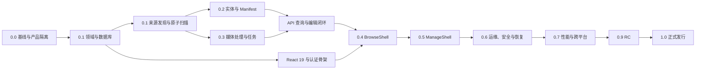

# Cosplay Gallery Manager 第一版完整开发流程计划

> 状态：第一版执行基线  
> 上游需求：[COSPLAY_DEVELOPMENT_MEMO.md](./COSPLAY_DEVELOPMENT_MEMO.md)  
> 适用范围：从当前 Stash 代码基线启动独立产品开发，直至 `1.0.0` 发行  
> 工作名：Cosplay Gallery Manager  
> 最后更新：2026-08-15

## 1. 计划目标

本计划把开发备忘录中已经确认的产品、领域、前端、媒体、运维和发布约束，转换为可排期、可测试、可验收的第一版开发流程。

第一版交付目标是一个可离线运行、单所有者使用、以 Gallery 为最小管理单元的独立产品。它能够：

1. 从 DIRECTORY、ZIP/CBZ、TAR/TAR.GZ/TGZ或7Z单一来源发现并导入 Gallery。
2. 在不删除用户媒体文件的前提下完成扫描、对账、分类、排序、排除和媒体派生处理。
3. 管理 Coser、Work、Character、Tag、Credit、Cast、Manifest 和个人状态。
4. 提供全新的 React 19 BrowseShell 与 ManageShell。
5. 在 Linux amd64/arm64 和 Docker 双架构上完成正式验收。
6. 以 AGPLv3 发布，并提供对应源码和第三方许可证清单。

## 2. 执行原则

### 2.1 不可破坏的产品不变量

以下规则不是普通功能项，而是所有设计、代码评审和测试的前置约束：

- Gallery 是聚合根，也是导入、扫描、编辑、处理、展示和删除数据库记录的最小业务单元。
- 一个 Gallery 只有一个 GallerySource，来源不可嵌套，也不可附加来源外媒体。
- 媒体不跨 Gallery 复用；相同内容位于不同来源时，仍是互不影响的独立 GalleryItem。
- File、Image/Scene 与 GalleryItem 严格 1:1；跨来源不得用指纹合并。
- 所有可移植 UUID 跨实体类型全局唯一，Alias 与 Tombstone 永久占用旧 UUID。
- 应用不能删除任何用户媒体来源文件，只能清理应用生成的数据。
- 只支持全新数据库；检测到原 Stash 或未知非空数据库时拒绝启动。
- 第一版核心流程服务端零主动外联，前端资源全部本地化，完整功能可离线运行。1.5允许默认关闭、所有者显式触发且可拔除的Coser资料Provider；它不得被启动、Browse、扫描或计划任务调用。
- Browse API 只返回 Gallery 级 DTO，不向浏览页面泄漏单媒体旧业务模型；物理路径仅允许在已认证单所有者的Gallery详情“更多详情”中以去重绝对父目录摘要形式出现，不返回文件名、Item相对路径、指纹或缓存路径，也不扩散到列表/卡片/成员DTO。
- 所有资源统一认证；Browse 与 Manage 使用不同可见性校验。

### 2.2 开发方式

- 采用短周期纵向切片：每个里程碑都包含数据库、领域服务、API、最小界面和测试闭环。
- 先固定不变量和接口，再开展大规模 UI 页面开发。
- 先实现 DIRECTORY 与静态图片的最小闭环，再依次接入归档、RAW、动画和视频。
- 新旧前端只在迁移期并存；新业务不得继续叠加到 `ui/v2.5`。
- 复用 Stash 的底层文件、图片、任务和流式能力时，必须通过新领域适配层隔离旧 Image/Scene/Gallery 业务语义。
- 不为尚未确定的联网、插件、AI 推荐或多用户需求提前建设通用运行时框架；1.5 Coser资料导入只使用代码级Provider契约和编译期组合，不建立插件执行系统。

### 2.3 每个工作项的完成定义

工作项只有同时满足下列条件才可标记完成：

1. 验收条件已有自动化测试，异常路径也被覆盖。
2. 数据库变更包含 schema、约束、索引和新库初始化测试。
3. GraphQL 变更同步更新 schema、DTO、权限检查和前端类型生成。
4. 可见文本进入 i18n，界面支持中英文且键盘可操作。
5. 日志默认只包含技术 ID 与错误码，不泄漏路径和业务元数据。
6. 相关设计、Manifest schema、配置或用户操作说明同步更新。
7. Go 检查、前端检查、相关集成测试和回归阻断集全部通过。

### 2.4 变更与评审流程

- 项目使用独立主分支演进，不以兼容 Stash 上游合并作为设计目标。
- 每个功能分支只承载一个可验收工作包；数据库、API、UI 与测试可以在同一纵向切片内提交。
- 改变本计划第 2.1 节不变量、Manifest v1、公开路由或 ACTIVE 校验前，必须先提交 ADR，并同步修改开发备忘录与本计划。
- 数据层评审关注约束、事务和恢复；媒体评审关注只读、安全和资源上限；Browse 评审关注 scope 与 DTO；Manage 评审关注 revision、审计和高影响确认。
- 不按假定人力给出日历承诺；先按依赖完成门禁，确定实际团队规模和吞吐后再给工作包配置迭代日期。

## 3. 总体依赖与关键路径

关键路径是：产品隔离 → 领域数据库 → 来源扫描 → 媒体可用性 → Gallery API → Browse → Manage → 恢复与发布。

在领域模型稳定后，下列工作可以并行推进：

- Manifest 与实体生命周期；
- 媒体处理与持久化任务队列；
- React 19 基础设施、设计系统和认证壳层。

## 4. 版本与里程碑总览

| 里程碑 | 主要结果 | 对外可用程度 |
| --- | --- | --- |
| 0.0 | 独立产品基线、构建与 CI 骨架 | 开发基线 |
| 0.1 | 新数据库、Gallery 聚合根、确定性发现与原子扫描 | 可导入和对账 |
| 0.2 | 核心元数据、实体关系、Manifest 与生命周期 | 可完整编辑元数据 |
| 0.3 | 图片、RAW、动画、视频、封面、缓存和任务 | 媒体可稳定浏览 |
| 0.4 | 新 BrowseShell 全部第一版页面 | 可日常浏览 |
| 0.5 | 新 ManageShell、导入、编辑、诊断和设置 | 可日常管理 |
| 0.6 | Setup、认证、审计、备份恢复和维护模式 | 可安全运行 |
| 0.7 | 性能、跨平台、可访问性和离线发行加固 | Beta |
| 0.9 | 数据冻结、发布阻断回归、RC | 候选发行 |
| 1.0 | AGPLv3 正式发行与完整交付物 | 正式版 |

版本号表示产品成熟度，不代替数据库、Manifest 和媒体处理版本；四套版本必须独立维护。

## 5. 阶段 0：仓库基线与独立产品隔离（0.0）

### 5.1 目标

在不破坏当前可构建基线的情况下，建立完全独立的产品身份、目录边界、构建入口和测试框架。

### 5.2 工作包

#### P00-01 基线冻结与可复用边界

- 记录当前 Go、GraphQL、SQLite、媒体处理、任务、流式服务和构建链的可复用模块。
- 建立旧业务替换清单：Scene/Image 单媒体页面、旧 Gallery 语义、网络刮削、插件、Clean 和物理删除入口。
- 为可复用底层模块增加适配层边界，禁止新代码直接依赖旧业务 resolver 或旧 UI 类型。

#### P00-02 产品身份与配置命名

- 建立产品 ID、应用名、数据库标记、默认配置目录、缓存目录和备份格式。
- 清理面向用户的 Stash 品牌文字，同时保留许可证要求的 Stash 归属说明。
- 建立产品版本、数据库 schema 版本、Manifest schema 版本和媒体处理 profile 版本的独立常量。
- 将启动路径、监听、日志和依赖覆盖保留在配置文件，将媒体库、规则、扫描、界面、推荐和任务等运行时业务设置放入数据库，禁止同一设置双写。

#### P00-03 新前端与代码生成骨架

- 新建 `ui/web` React 19 应用。
- 复用 Apollo、GraphQL codegen 和 i18n 基础能力，不复用旧 Bootstrap 页面结构。
- 建立 BrowseShell、ManageShell、SetupShell、路由、错误边界、主题变量和本地资源入口。
- 新增前端 `validate`、`test`、`build` 与 `test:e2e` 标准脚本，并接入 Makefile。

#### P00-04 CI 与许可证基线

- 保持现有 Go 测试、生成和 lint 可运行。
- 增加新前端检查、SQLite 集成测试和最小浏览器冒烟测试。
- 生成第三方依赖许可证清单；建立发行源码归档检查。
- CI 禁止依赖主动公网请求完成核心测试。

### 5.3 退出门禁 G0

- 当前后端和旧前端仍可构建，新 `ui/web` 可独立构建并显示空壳页面。
- 新产品 ID 与四套版本已定义且有测试。
- CI 能并行执行 Go 检查和新前端检查。
- 没有任何新业务页面提交到 `ui/v2.5`。

## 6. 阶段 1：领域内核与新数据库（0.1-A）

### 6.1 目标

建立 Gallery 优先的新领域模型和 SQLite WAL 数据层，为所有后续功能提供稳定身份、状态和并发边界。

### 6.2 工作包

#### P01-01 数据库启动保护

- 新库写入独立产品标识和 schema 版本。
- 空库可初始化；原 Stash、未知非空库、产品标识不匹配时拒绝启动。
- 第一版只启用本地 SQLite WAL，设置 busy timeout、外键和一致性检查。
- 建立基于 SQLite 在线备份 API 的一致性快照接口。

#### P01-02 UUID Registry

- 为 Gallery、GalleryItem、Coser、Work、Character、Tag、ExternalLink、SocialAccount 等建立全局 UUID 注册。
- 建立 UUID Alias、Merge 记录和永久 Tombstone。
- 数据库约束阻止跨类型 UUID 重复和 Tombstone UUID 重建。

#### P01-03 Gallery 聚合根

- 实现 Gallery、GallerySource、GalleryItem 的基础表与仓储。
- 强制一个 Gallery 一个来源、Item 只属于该来源、来源不可嵌套。
- 实现 DRAFT、ACTIVE、ARCHIVED 状态机和 ACTIVE 校验框架。
- `added_at` 只在首次激活时写入，恢复、归档和重扫不刷新。
- 建立 `metadata_revision` 乐观锁。

#### P01-04 状态与问题模型

- 来源使用 availability、reconcile_state、GallerySourceIssue 三层模型。
- Item 分离文件可访问性与媒体处理状态。
- 后端派生 Gallery 的 `browsable`，而不是前端自行组合状态。
- 来源不可访问时只改变来源状态并暂停浏览，不批量把成员改为 MISSING。

#### P01-05 个人状态基础表

- 建立无 `user_id` 的 GalleryPersonalState 与 GalleryItemPersonalState 1:1 表。
- Gallery 与 Item 评分均为 0.5 步进五星制。
- 收藏时间、最后浏览时间与评分时间使用 UTC 系统事件时间。
- 第一版不建立 view_count、播放进度或观看状态字段。

### 6.3 最小纵向验收

通过测试辅助接口创建一个无来源 DRAFT Gallery，绑定一个 DIRECTORY 来源和两个独立 Item，验证：

- 一个 Item 不可绑定多个 Gallery；
- 来源外路径不可成为成员；
- ACTIVE 校验失败不会静默修复元数据；
- 两个来源中的相同指纹文件保持两个独立 Item；
- 并发保存时旧 `metadata_revision` 被拒绝。

### 6.4 退出门禁 G1

- 新数据库身份、外键、唯一性、状态机和 UUID 永久占用测试全部通过。
- 原 Stash 数据库与未知非空数据库拒绝启动测试通过。
- 领域层不依赖旧 Gallery 软组合语义。

## 7. 阶段 2：媒体库、候选与原子扫描（0.1-B）

### 7.1 目标

完成从物理来源到 DRAFT Gallery 的确定性发现、两阶段导入、成员对账和失败恢复。

### 7.2 工作包

#### P02-01 媒体库根与所有权

- 最具体的媒体库根拥有路径；父库扫描跳过已配置子根。
- 被禁用的子媒体库仍然是边界，直到用户明确移除。
- 新增、删除或改根必须先预览影响。
- 已有 GallerySource 只能显式转移或进入未分配状态，父库不得静默重新导入。
- DIRECTORY 永不跟随符号链接，所有相对路径使用 NFC 与正斜杠规范化。
- 媒体库可使用只读或操作系统级 SMB/NFS 挂载；SQLite 数据库不得放在网络挂载中。

#### P02-02 确定性根识别

- 严格按 IgnoredGallerySource → 已绑定 GallerySource → 有效 Manifest → 内置ARCHIVE_FILE → `.cosplay-root` → PATH_TEMPLATE → FIXED_DEPTH/DIRECT_CHILD → 人工绑定处理。
- 已绑定来源是人工显式身份；PATH_TEMPLATE 是尚未绑定来源的自动规则最高优先级。
- 多种自动规则可以同时启用，默认全部关闭。
- DIRECT_CHILD 是 FIXED_DEPTH=1 的界面预设；深度规则不生成元数据建议。
- MARKER的来源根保持为`.cosplay-root`所在父目录；新发现时若仅有一个直属真实子目录，确定性标题保底使用该子目录名，否则使用来源根目录名。已有Gallery、根级媒体Exclude策略和ARCHIVE发现均不受影响。
- 安全且包含受支持媒体的Archive文件以内置`ARCHIVE_FILE`方式直接成为独立候选，不依赖PATH_TEMPLATE或FIXED_DEPTH；已确认DIRECTORY根优先拥有其子树，防止内部Archive形成嵌套Gallery。
- Archive手工发现默认只生成Candidate；ASSISTED/TRUSTED策略通过默认关闭的媒体库级开关显式授权自动创建DRAFT。加密、损坏、不安全、无受支持媒体和超限Archive不得自动导入。
- 移除启发式候选模块；未归属媒体只生成按实际父目录聚合的DIRECTORY诊断报告，安全受支持Archive不得误报为未分配媒体文件夹。

#### P02-03 正则建议系统

- 基于 RE2 匹配完整规范化相对路径。
- 命名捕获只形成 Coser、Work、Character、日期和标题建议。
- 规则按顺序执行并提供扫描前预览。
- 自动规则默认只生成候选；逐规则可启用 AUTO_CREATE_DRAFT。
- 结构化建议必须人工接受后才写入正式元数据。

#### P02-04 两阶段导入

- 阶段一只确认物理来源、冲突、单来源约束和安全限制，并创建 DRAFT。
- 阶段二进入 Gallery 编辑页审核元数据、成员、排除和 Manifest。
- 未处理的 Coser、Work、Character 建议阻止激活；标题和日期建议不阻止。
- 用户明确拒绝角色建议后，才允许按 Album 校验激活。

#### P02-05 扫描暂存与原子提交

- 扫描结果先写入 source-scoped staging，再在完整成功后原子提交。
- 中断、崩溃或来源暂时不可访问时保留上一版成功状态，不产生半扫描 MISSING。
- 首次扫描与后续扫描复用同一对账引擎。
- 扫描只负责发现和对账；缩略图、动画、视频和 RAW 进入独立任务队列。

#### P02-06 指纹、移动与缺失

- 使用 BLAKE3 快速采样缩小候选，只有完整内容 BLAKE3 才能确认匹配。
- 同一来源同路径优先保留 `item_uuid`；内容变化记录 CONTENT_REPLACED 并重建派生资源。
- 同一来源内使用完整 BLAKE3 唯一匹配保留 `item_uuid`。
- 单文件缺失标记 MISSING 并保留全部元数据；唯一匹配时才自动重绑定。
- 多个指纹候选时不得自动选择：旧 Item 保持 MISSING，新文件形成独立 Item 等待审核。
- `set_id` 只形成来源重绑定候选，改绑必须人工确认。
- 重复 `set_id` 可显式分叉，重新生成 Gallery 局部 UUID，并要求写回副本 Manifest。

#### P02-07 忽略、排除与防重建

- IgnoredGallerySource 高于所有显式和自动识别规则，并优先使用 `set_id`。
- LibraryPathIgnoreRule 只影响未绑定路径发现。
- GalleryItemExclusion 只影响已绑定来源内成员。
- 来源内媒体默认纳入；排除保留 Item 和元数据，重扫不得恢复，显式忘记才删除记录。
- 增加独立数据库媒体自动排除规则：第一阶段仅对DIRECTORY新Item按全局/媒体库范围、路径/文件匹配及媒体类型决定EXCLUDE或INCLUDE；根级媒体本次扫描开关优先，既有路径/指纹重绑定Item保持持久决定，Archive不变。
- Gallery 删除后写入永久 Tombstone 与 Ignore，文件保留时也不得重建。

#### P02-08 归档与资源安全

- ZIP/CBZ、TAR、TAR.GZ/TGZ和7Z禁止路径穿越、绝对路径、危险链接和超限解压资源。
- 默认限制为总 Entry 20,000、单成员解压后 2GiB、总解压估算 100GiB、单图 200MP、压缩比 1,000。
- 阈值可配置，但 Unicode/大小写重复、加密 Entry、嵌套归档、路径穿越和特殊文件等结构性安全校验不可关闭。
- 归档中的未排除视频、RAW 和 AVIF 是激活阻断错误。
- Archive不可附加外部视频或其他外部媒体来源。

#### P02-09 成员排序与上限

- 首次按规范化完整相对路径自然排序分配 int64 Position。
- Position 初始间隔为 1,024，在 Gallery 内全局唯一，但只在所属媒体组内比较。
- 新增成员只追加；重新按文件名排序必须人工触发。
- 使用 Gallery 全局高水位；组内间隔耗尽时只迁移该组到新区间。
- Manage按完整父目录分组，根目录固定排在所属媒体组最前；文件夹只能在PHOTO、SELFIE、ANIMATED_IMAGE或VIDEO各自组内排序，移动文件夹保留内部顺序，具体文件夹可显式按文件名自然排序。
- 文件夹或文件夹内顺序通过完整组成员UUID列表原子提交；后端校验列表恰好覆盖同一媒体组，拒绝重复、遗漏、跨组和过期revision。
- 用户扫描默认只自动排除本次新发现的根目录媒体，并提供本次扫描开关；既有Item的Exclude/Restore选择不被重扫覆盖。
- 单 Gallery 非排除成员超过 1,000 时进入 OVER_LIMIT，禁止激活或退出浏览。

### 7.3 退出门禁 G2

- DIRECTORY及全部受支持Archive候选和两阶段导入集成测试通过。
- 父子媒体库、路径规范化、符号链接、路径穿越、扫描中断和来源失联测试通过。
- 两次扫描在输入未变时产生幂等结果。
- 应用代码不存在删除用户来源媒体文件的调用路径。

## 8. 阶段 3：核心元数据、关系与 Manifest（0.2）

### 8.1 目标

完成 Gallery 业务元数据、核心实体生命周期、可移植身份和显式 Manifest 同步。

### 8.2 工作包

#### P03-01 Gallery 元数据与类型推导

- 实现标题、别名、日期精度、直接 Tag、内容分级、评分、受限 Markdown description、摄影师、`studio_name`、ExternalLink 等字段。
- `shoot_date` 使用无时区日历值并保留日/月精度；未知日期不进入时间线。
- Gallery 不保存 `collection_type`：GalleryCast 为空即 Album，非空即 Cosplay。
- Photographer 与 Studio 都是 Gallery 单值自由文本，仅展示和同步 Manifest。

#### P03-02 Credit 与 Cast

- GalleryCredit 不区分 Coser/Model；全局排序。
- GalleryCast 必须引用具体 Credit、Character，且 Character 与 Work 严格一致。
- Cast 按所属 Credit 内排序，两层顺序派生 Character/Work 摘要。
- ACTIVE Cosplay 中每个 Credit 至少有一个角色配对。
- ACTIVE Album 至少有一个 Credit 且 Cast 必须为空。
- Cosplay/Album 转换先回到 DRAFT，不静默删除 Cast，不自动创建关系。

#### P03-03 Coser、Work、Character 与 Tag

- Coser 实现精简资料、Profile Summary、Biography、头像、Banner 和 SocialAccount。
- Profile Summary 是最多 20,000 字符的可展开长纯文本；Biography 是受限 Markdown。
- Work/Character 仅保留 UUID、名称、别名、排序、Slug 和必要关系。
- 一个 Character 第一版只属于一个主要 Work，且同一 Work 内名称唯一。
- Tag 只保留名称、别名、DAG 层级和推荐开关；允许多父，严格禁止环。
- Coser/Work 可重名；Tag 名称与别名全局无歧义。
- SocialAccount 使用可扩展 `platform_key`、本地图标、人工 ACTIVE/INACTIVE/visible 状态和稳定 Position；未知平台正常显示。

#### P03-04 合并、删除与 Slug

- 所有核心实体独立 `metadata_revision`。
- 合并前完整预览并解决关系冲突，原子提交且不可反向拆分。
- 合并保留永久 UUID Alias，并将受影响 Gallery 标记为待 Push。
- 核心实体只有无引用时可删除；删除 UUID 进入永久 Tombstone。
- Slug 作为 UTF-8 可读稳定地址，保留轻量历史重定向，但不作为永久身份。

#### P03-05 Gallery Manifest v1

- DIRECTORY 使用目录内 `.cosplay.json`；归档使用相邻 `<完整归档文件名>.cosplay.json`。
- Manifest 可选；NONE 与同步后丢失的 MISSING 明确区分。
- 首次导入自动读取，后续扫描只检查状态；Pull/Push 必须用户显式触发。
- 手写 Manifest 可部分提供，系统 Push 输出完整快照。
- 集合按稳定 UUID 或首次精确相对路径复合键拆分；基线后 Item 更新必须用 UUID。
- Rating 可同步；收藏、历史和 GalleryItem 收藏只存数据库。

#### P03-06 三方同步引擎

- 保存基线快照、外部文件哈希、系统 Push `revision` 和格式 `schema_version`。
- 按字段和集合成员执行“基线—数据库—Manifest”三方比较。
- 双方人工修改同一字段时不自动覆盖，生成结构化冲突。
- 数据库与 Manifest 都以人工显式操作优先。
- 只允许 `extensions` 容纳未知扩展字段；写入前只保留一份 `.bak`。

#### P03-07 Coser Manifest 与托管资源

- 单一可配置 Coser 元数据根，每个 Coser 使用 `<uuid>/coser.json`。
- 有效独立 Manifest 可按 UUID 创建未关联 Coser，但只在 ManageShell 可见。
- 头像/Banner 只允许本地静态图片；保存 1:1 裁切区域和归一化焦点。
- 合并后的旧 UUID 目录保存独立 `redirect_to_uuid` 文件。
- Work/Character 完整资料只在数据库；Gallery Manifest 只保留 UUID 和名称提示。

#### P03-08 Item 元数据

- 静态图片默认 PHOTO；SELFIE 只能由人工或 Manifest 确认。
- 可管理的媒体分类规则支持父目录、文件名、文件stem与完整相对路径的Exact/Glob/RE2匹配；只对静态图片产生非阻断PHOTO/SELFIE建议，并按规则revision保留接受或拒绝结果。无效RE2/Glob必须在后端保存前拒绝。
- 可管理的自动排除规则与媒体分类保持业务分表但复用纯路径匹配器；存量评估只产生待审核EXCLUDE建议，规则修改/删除和普通重扫不得静默恢复或覆盖Item状态。schema v5与完整门禁见[专项计划](development/MEDIA_EXCLUSION_RULES_PLAN_2026-08-28.md)。
- Item 只具有 Gallery 上下文中的 media kind、分类、Caption、Position、排除、评分和收藏。
- Caption 为受长度限制的短纯文本，不扩展成单媒体完整业务元数据。

#### P03-09 文本、链接与结构限制

- Markdown 仅用于 Gallery description 和 Coser biography，禁止原始 HTML、图片、iframe、embed、style 和危险协议。
- ExternalLink 只允许人工绝对 HTTP(S) URL，类型为 SOURCE/PROFILE/REFERENCE；不抓取、检查、代理或下载外部内容。
- 所有名称/标题/Alias 最多 300 字符，Alias 每实体最多 100；Caption 最多 1,000，主要长文本最多 20,000。
- Photographer/Studio 最多 200 字符；链接、账号、Credit、Cast、直接 Tag 和直接父级按备忘录硬上限校验。
- 所有限制按 NFC 后 Unicode 码点计算，超限返回具体字段路径，绝不静默截断。

### 8.3 退出门禁 G3

- Gallery 的 Album/Cosplay 推导和 ACTIVE 关系约束测试通过。
- Tag DAG 环检测、多父层级、UUID Alias/Tombstone 测试通过。
- Manifest 首导、Pull、Push、丢失、外部修改、集合冲突和只读来源测试通过。
- 任意 Manifest 名称提示冲突不会按扫描顺序静默决定。

## 9. 阶段 4：媒体处理、封面、缓存与任务（0.3）

### 9.1 目标

让每个 AVAILABLE Item 具备可控、可恢复、可认证的展示资源，并将高成本工作从扫描事务中分离。

### 9.2 工作包

#### P04-01 内容识别

- 扩展名只负责发现，实际文件内容决定静态、动画或视频分类。
- 格式错配保留并告警；图片后缀伪装视频必须确认后才能激活。
- 支持既定图片/视频格式和常见 RAW；不支持 SVG、音频、RAR、7z。
- EXIF/XMP 只读，日期只形成建议；无时区 EXIF 按媒体库 `capture_timezone` 解释。

#### P04-02 持久化租约队列

- 建立数据库持久化任务、优先级、租约、心跳、重试、取消和死信状态。
- 异常重启后恢复任务；按来源、Item 内容版本和处理 profile 保证幂等。
- Gallery 级优先队列支持用户触发优先处理。
- 扫描技术修正与 Gallery 元数据 revision 分离。
- 当前查看、封面/卡片和 ACTIVE 首批优先于普通 ACTIVE、DRAFT 与 ARCHIVED；结构性不支持错误不重试。

#### P04-03 静态图片与 RAW

- 复用 Stash 底层图片处理能力，但重建 GalleryItem 路由、缓存键和上层接口。
- 网格使用响应式派生图，Lightbox 默认使用最长边 4096px 代理。
- 兼容格式允许按需查看原图；RAW 通过 LibRaw 只读解码且只显示代理。
- RAW 与同名 JPEG 保持独立，只提示伴生关系。
- 为 PHOTO、SELFIE 和 RAW 提供Gallery卡片Scrubber可用的轻量响应图/基础代理variant。

#### P04-04 动画与视频

- 动画保留静态 Poster；普通媒体卡片可播放短时低负载代理，Gallery卡片Scrubber只使用Poster；详情尽量显示原动画。
- 视频优先直接播放，其次 Remux，必要时生成 H.264/AAC MP4 代理。
- 第一版确定性选择单视频轨和单音轨，不处理字幕选择。
- 代理统一正确旋转，HDR 转 SDR；不持久化播放进度与观看状态。

##### P04-04A 视频完善第一阶段：依赖、探测与Poster

- 增加FFmpeg/FFprobe成对解析、版本校验和Manage只读诊断；依赖缺失不阻断图片/RAW业务，但视频任务必须返回明确错误码。
- 通过受控前向数据库迁移建立GalleryItem 1:1视频技术元数据，持久化当前content revision的容器、主轨、时长、编码、尺寸、帧率、旋转和HDR信息；不保存路径或原始ffprobe JSON。
- 视频扫描后先幂等探测，探测成功再生成BASE Poster；Poster默认从有效时长约20%处截取，快速seek失败后精确seek，长边上限960px且不放大。
- 内容替换使旧技术元数据与派生资源失效；既有视频采用有界低优先级回填，不在schema迁移事务中批量读取来源。

##### P04-04B 视频完善第二阶段：直放与按需代理

- 以持久化技术元数据和经目标浏览器验证的保守兼容矩阵决定DIRECT、REMUX或TRANSCODE，不按文件后缀或Stash旧Scene字段判断。
- DIRECT通过`item_uuid + content_revision`认证路由在保持来源路径私有的前提下提供GET/HEAD/Range；只支持DIRECTORY视频并保持原始文件只读。
- REMUX/TRANSCODE只在Lightbox当前视频或媒体详情实际打开时幂等排队；统一生成Fast Start MP4，必要时转H.264/AAC、应用旋转与HDR到SDR，最高1080p且不放大。
- `VIDEO_PLAYBACK`保持ENHANCED并受现有LRU约束；前端在准备期间显示Poster，发布后无整页刷新切换播放器，离开当前媒体立即停止上一视频。
- Gallery列表、卡片、Scrubber、推荐和随机查询不得触发播放任务。详细数据模型、错误码、实施顺序和验收矩阵见[1.5视频处理阶段规划](development/VIDEO_PROCESSING_PHASE_1_2_PLAN_2026-08-15.md)。

> Storyboard辅助时间轴及按证据决定的单清晰度渐进HLS已记录于[视频处理第三阶段功能规划](development/VIDEO_PROCESSING_PHASE_3_PLAN_2026-08-15.md)，但仍属于第一版明确延期能力，不进入P04/G4或1.5完成判定。

#### P04-05 双层缓存

- 基础展示资源长期保留，确保 Gallery 可浏览。
- 增强资源按容量和磁盘余量执行 LRU 清理。
- 增强缓存默认 50GiB，最低磁盘余量默认 `max(10GiB, 5%)`，均可配置。
- 新处理 profile 成功前继续服务旧资源，成功后原子切换。
- 缓存维护只能删除应用生成的数据。

#### P04-06 双层封面模型

- `preferred_cover` 保存人工或 Manifest 意图，`effective_cover` 保存实际可展示结果。
- 首次发现成员后只随机一次静态图片并持久化为 AUTO_RANDOM。
- AUTO_RANDOM 缺失时自动重新初始化；人工/Manifest 封面缺失时保留意图并启用随机替代。
- 纯视频或没有静态图片时不随机，可用 Video Poster 作为临时 effective cover，但不写入随机意图。
- 详情静态图片菜单可立即设封面并标记 Manifest 待 Push；支持撤销。
- DIRECTORY 独立封面位于 `.cosplay-assets/cover.*`；归档封面位于相邻 assets 目录，永不重打包归档。

#### P04-07 认证媒体服务

- 所有原图、代理、Poster、头像和 Banner 统一经过认证与可见性校验。
- Browse 只服务 browsable 且当前 scope 可见的资源；Manage 可查看诊断资源。
- URL 使用 UUID/资源版本定位，永不暴露物理路径。
- 支持 Range、缓存协商、稳定占位图和旧资源渐进切换。

#### P04-08 Gallery卡片混合媒体Scrubber资源

- 保留Stash“横向位置映射成员序号、离开恢复封面”的交互算法，但不复用旧Gallery Preview API、旧Image查询或数字ID。
- 构建可预览GalleryItem序列：PHOTO→SELFIE→ANIMATED_IMAGE→VIDEO，组内按Position；只包含非排除、AVAILABLE且有可安全展示基础资源的成员。
- PHOTO/SELFIE使用响应图、RAW使用LibRaw基础代理、ANIMATED_IMAGE和VIDEO只使用静态Poster；Scrubber不播放动画/Video，也不触发Remux或转码。
- 资源缓存键包含item_uuid、内容revision、variant和processing profile；不得回退加载不受控原图。
- 缓存Gallery的可预览item_uuid序列，支持请求节流、过期请求取消和已访问ordinal复用，避免逐次SQL `OFFSET`。

### 9.3 退出门禁 G4

- 静态图片、RAW、GIF/动画、兼容视频、Remux 和代理回归样本通过。
- PENDING/ERROR/MISSING 不会进入随机或封面候选，计数口径符合备忘录。
- 任务在进程中断、重复投递和内容变更后可正确恢复。
- 未认证请求、跨 scope 请求和物理路径猜测均不能取得媒体。
- PHOTO/SELFIE/RAW/GIF/Video均能通过同一Scrubber契约返回正确静态派生资源，且动画/Video不会开始播放或转码。

## 10. 阶段 5：GraphQL 分层与领域查询（0.3-B）

### 10.1 目标

以稳定的 Browse DTO 和 Manage Mutation 封装领域能力，阻止新前端耦合旧单媒体 API。

### 10.2 工作包

#### P05-01 API 分层

- 保留 GraphQL 传输层，按 Browse、Manage、Setup/Session 划分 resolver 与权限。
- Browse 只暴露 Gallery 级专用查询、BrowseGalleryCard、成员轻量索引和实体索引 DTO。
- BrowseGalleryCard只携带Scrubber可用数量、预览版本等轻量状态，不内嵌全部成员URL。
- 新增以Gallery UUID、ordinal和不可变revision定位的专用认证预览资源契约，执行Browse可见性校验且不接受物理路径。
- Manage 暴露 Gallery 范围批量 Mutation、扫描诊断、Manifest、任务和设置接口。
- 移除旧 Scene/Image 独立浏览、旧Gallery Preview、网络刮削、插件和兼容 API。

#### P05-02 编辑并发模型

- 复杂 Gallery 元数据使用显式批量保存和 `metadata_revision`。
- 收藏、评分、封面、排序和技术操作即时生效。
- Gallery 范围批量操作必须事务化并返回逐项验证错误。
- Coser、Work、Character、Tag 使用各自 revision；设置使用 `settings_revision`。

#### P05-03 索引、Scope 与分页

- `/` 默认 LIST，可配置为 LIST/MAGIC/ALL；`/list` 与 `/magic` 为独立分区。
- Gallery 与个人列表每页 24，Coser 每页 30，Work/Character/Tag 每页 60。
- 索引使用 URL 页码；Gallery 详情不使用页码分页。
- 搜索显式携带当前 Home/List/Magic scope；Coser、Work、Character、Tag 详情默认 ALL。
- Coser 详情始终展示全部分级作品；实体详情可切换 ALL/LIST/MAGIC。

#### P05-04 搜索

- 只搜索 Gallery 及核心实体名称/别名。
- Gallery 可通过 Coser、Work、Character、Tag 关系间接命中。
- 排序使用明确的名称匹配等级；名称为实体索引默认排序。
- 保留最近收录与搜索相关度，不提供热门、热度或 view_count。

#### P05-05 时间线、相关推荐与随机

- 普通 Gallery 浏览默认最近收录；时间线按 shoot_date 月/日规则排序。
- 日期只有月时按该月 1 日排序，未知日期跳过；同日按 `added_at DESC, id DESC`。
- Coser 专属时间线使用相同算法并默认 ALL。
- 首页不做推荐；Gallery 详情提供强关系相关推荐和 Tag 相似推荐。
- 强关系分数为 Character×100、Work×50、同 Coser×40、同派生类型×5；候选必须共享 Character、Work 或 Coser，默认返回 6 项。
- Tag 推荐采用最多三层、IDF 加权 Jaccard、父标签 0.25、默认阈值 0.05，均可配置。
- 随机页默认 24，静态/GIF/Video 软配额 70/10/20，Gallery 重复衰减默认 0.25。

#### P05-06 完整成员轻量索引

- Gallery 详情一次返回完整轻量成员索引，不返回所有大图资源。
- 按 Photo+Selfie、GIF、Video 视觉分组；默认连续展示。
- 每组初始/手动展开 24 项，无页码分页。
- Lightbox 基于完整成员索引导航，不受网格展开批次影响。
- 媒体分类筛选由一组全局设置控制，默认关闭。

### 10.3 退出门禁 G5-API

- Browse schema 中除`GalleryDetail.mediaParentDirectories`这一已确认有限例外外，不存在物理路径；该字段只返回非MISSING实际媒体的去重绝对父目录，不得包含文件名、Item相对路径、指纹、缓存路径、旧 Scene/Image 业务字段或浏览计数。
- scope、分页、排序、搜索等级、时间线日期精度和推荐算法契约测试通过。
- 所有 Mutation 的 revision 冲突和权限拒绝均返回稳定错误码。
- Scrubber资源只能读取当前可见Gallery的合格成员；MISSING、UNREADABLE、排除及无可用Poster/代理成员不会被ordinal命中。

## 11. 阶段 6：React 19、Setup 与设计系统（0.3-C）

### 11.1 目标

建立可承载全部新页面的前端基础，不继承旧 Bootstrap 页面债务。

### 11.2 工作包

#### P06-01 应用壳层

- 实现 BrowseShell、ManageShell、SetupShell 和认证边界。
- 路由、GraphQL 类型、i18n、通知、错误页、加载骨架和响应式断点统一管理。
- 建立 GalleryEpic 风格的卡片、文字索引、详情布局和媒体网格设计 token。

#### P06-02 共用组件

- GalleryCard、MediaCard、CoserCard、EntityTextIndex、ScopeSwitcher、Rating、Favorite、IssueBadge。
- GalleryCard 固定 3:4，按 6/5/4/3/2 列响应，使用统一 BrowseGalleryCard 字段和 AVAILABLE P/S/G/V 计数口径。
- 新建React 19 GalleryCardPosterScrubber：横向位置映射ordinal、离开恢复effective cover，并在GalleryEpic风格中使用弱化预览轴。
- Scrubber切换只替换3:4封面容器内容，不改变卡片尺寸、文字区、R-18徽标、收藏/评分控件或主点击区域。
- CoserCard 使用 1:1 头像；Work/Character/Tag 使用无图片高密度文字索引。
- Lightbox、响应式图片、受限动画预览、Video Poster、菜单与右键行为。
- 成人 Gallery 使用小型三角 R-18 徽标。
- 卡片属性控件显示由三组全局配置管理，不为每个页面复制开关。

#### P06-03 无障碍与国际化

- 中英文界面；主名称与别名分开呈现。
- 图标含 tooltip 与 aria-label；拍摄时间和收录时间不用可见文字标签，但保留可访问名称。
- 键盘可完成导航、分页、筛选、收藏、评分和 Lightbox 操作。
- 动画遵循 reduced-motion；颜色、焦点和触控目标满足备忘录验收范围。
- Scrubber只在支持Hover的精确指针设备上启用；触摸与键盘仍通过普通卡片进入Gallery，不能有Scrubber独占信息。

### 11.3 退出门禁 G5-UI

- 新壳层可登录、切换 Browse/Manage、切换语言和 scope。
- 组件在桌面与移动视口通过视觉回归和键盘冒烟测试。
- UI 不引用旧 Bootstrap 组件或旧 Scene/Image 页面路由。
- Scrubber开启时能够节流切换静态派生资源并在离开时恢复effective cover；关闭时不挂载交互层且不产生预览请求。

## 12. 阶段 7：BrowseShell 全量实现（0.4）

### 12.1 建议实现顺序

#### P07-01 首页与分区索引

- `/` 只显示近期收录，默认来源 LIST，后台可切换 LIST/MAGIC/ALL。
- `/list` 与 `/magic` 使用相同布局和卡片，内容范围贯穿搜索、时间线和随机。
- 首页不显示最新 Cosplay/Album、推荐、热门或近期 Coser；只按 `added_at DESC, id DESC` 显示 24 项。
- 首页无结果时隐藏内容区；详情推荐无结果时明确改名为“近期收录”。
- 首页、List/Magic、实体详情、时间线、Gallery收藏等所有BrowseGalleryCard网格共用混合媒体静态Poster Scrubber；随机页和媒体收藏页的单媒体卡片不使用。
- Scrubber中的PHOTO/SELFIE/RAW使用响应图/代理，GIF与Video只显示Poster；激活、切换和资源加载均不记录浏览历史。

#### P07-02 Gallery 详情与 Lightbox

- 完整实现标题、封面、Credit/Cast、Work/Character、Tag、拍摄/收录时间、计数和弱化 ExternalLink。
- 日期以图标、字体、字号和颜色区分，保留 tooltip/aria-label。
- 媒体默认按组连续展示，手动逐批展开；Photo 与 Selfie 同组但排序保持优先级。
- Gallery 内点击进入 Lightbox；静态图片菜单可设封面。
- 推荐与猜你喜欢区遵守当前内容 scope。

#### P07-03 Coser 页面

- Coser 索引、详情、头像/Banner、Profile Summary、Biography、社交账号和作品网格。
- ACTIVE/INACTIVE 账号保持人工顺序，INACTIVE 只做视觉弱化。
- 详情默认 ALL 且显示全部作品，提供专属时间线按钮。

#### P07-04 Work、Character 与 Tag

- Work/Character 使用无图片高密度文字索引。
- Work 详情只显示当前次级 scope 内有关联 Gallery 的 Character，不直接展示 Gallery。
- Character 详情展示相关 Gallery；Work/Character 详情默认 ALL，可切换范围。
- Tag 详情默认 ALL，包含自身及全部后代；多 Tag 筛选为 AND；Gallery 详情只显示直接 Tag。

#### P07-05 时间线、随机与媒体详情

- 全局与 Coser 时间线使用相同 GalleryCard 风格。
- 随机媒体卡采用 3:4、Character 行+Coser 行，不显示 Gallery 标题；Album 保留空白 Character 行。
- 随机页左键进入 `/media/<item_uuid>`，菜单进入所属 Gallery。
- 媒体详情桌面为媒体主体+Gallery 侧栏，移动为上下布局，不提供上一项/下一项或单媒体业务元数据。

#### P07-06 收藏与历史

- 收藏页提供作品集/媒体两个 Tab。
- 媒体收藏卡复用随机卡，只增加移除收藏、评分排序和分页。
- Gallery 收藏按 `favorited_at`，历史按 `last_viewed_at`；默认 LIST 并支持 LIST/MAGIC/ALL。
- 只有打开 Gallery、媒体详情或 Lightbox 才记录所属 Gallery 历史；曝光和自动预览不记录。

### 12.2 退出门禁 G6

- 备忘录定义的 Browse 路由全部存在并通过端到端主路径测试。
- 所有列表页分页量、默认排序和 scope 与契约一致。
- Gallery 详情可在 1,000 个成员下完成轻量索引加载和分批媒体展开。
- 不存在热门、热度、浏览次数或独立 Scene/Image 浏览入口。
- 1,000成员Gallery的卡片不会在列表初次加载时请求全部预览资源，快速横移不会造成无界并发请求或布局位移。

## 13. 阶段 8：ManageShell 全量实现（0.5）

### 13.1 建议实现顺序

#### P08-01 Gallery 管理索引

- 顶部问题队列摘要、高密度表格、状态/scope/issue 筛选和严格受限批量操作。
- 明确显示 DRAFT、OVER_LIMIT、来源不可用、Manifest 冲突、封面缺失和处理错误。
- 路径只允许显示和复制；服务端不能打开文件管理器、播放器或执行外部命令。

#### P08-02 两阶段导入界面

- 候选预览、规则命中来源、路径冲突、归档安全、`set_id` 重绑定/分叉和 DRAFT 创建。
- 第二阶段在编辑页逐项接受或拒绝元数据建议。
- 未归属媒体诊断按父目录聚合，支持用户手工选根或修改确定性规则。

#### P08-03 Gallery 五页签

- 基本信息：标题、日期精度、分级、Tag、文本、评分、ExternalLink。
- 人物与角色：Credit、Cast、Coser、Work、Character 和顺序。
- 媒体成员：分组、Position、分类建议、Caption、排除、封面和技术状态。
- 来源与扫描：来源状态、issues、扫描、重绑定、归档限制和诊断。
- Manifest：状态、基线、差异、冲突、Pull、Push、缺失与只读提示。

#### P08-04 Coser 四页签

- 个人资料、社交账号、关联作品集、Manifest。
- 头像裁切、Banner 焦点、长文本、账号顺序和独立 Manifest 资源管理。
- 第一版只定义账号检测 Provider 接口，不实现 Provider、任务或结果表。
- 1.5资料导入Provider的候选/账号集合使用非null数组契约；前端对旧版或异常响应做空数组标准化，并以网络资料面板局部错误边界隔离渲染失败，禁止单个候选导致整个Manage页面黑屏。
- 1.5资料导入搜索在成功完成后必须显示候选数量或明确的零结果提示；修改查询词或Provider立即清除旧候选，避免旧结果被误认为新结果。服务端只记录请求ID、Provider key和候选数，不把姓名或查询词写入日志。

#### P08-05 核心实体管理

- Work/Character/Tag 的最小字段编辑、关系维护、Slug 历史、DAG 环检测。
- 新建Coser前对主名与Alias进行Unicode规范化精确查重，展示可识别的已有人物摘要并提供直达入口；允许真实同名人物，但必须显式确认后继续创建。
- Coser管理列表支持全库名称/Sort name/Alias搜索、头像与Banner完善度筛选、30/60/100页量和首页/末页/页码直达；列表状态及当前实体写入URL，保持可刷新、可返回和可深链。
- Coser管理列表在筛选后、分页前按固定zh-CN Unicode Collation混排英文名称与中文拼音；非空Sort name保持最高优先级，供所有者覆盖多音字或人名特殊读音，不依赖宿主机locale。
- Coser/Work/Character/Tag 合并预览、冲突处理、Alias 和 Tombstone。
- 只有无引用实体提供删除数据库记录操作。

#### P08-06 设置、任务与诊断

- 三组界面属性设置、首页来源、媒体筛选、`gallery_card_scrubber_enabled`、推荐阈值、随机配额、归档阈值和自动扫描设置。
- `gallery_card_scrubber_enabled`为全局数据库设置且默认开启；关闭后全部Gallery卡片只显示effective cover，前端不得请求Scrubber索引或资源。
- 默认自动扫描关闭；支持手工、启动时和定时扫描。
- 任务队列、重试、取消、缓存容量和处理 profile 状态。
- LibraryPathIgnoreRule、IgnoredGallerySource、GalleryItemExclusion 分层管理。
- 在Libraries & import提供独立双语自动排除规则区，按全局/当前媒体库分组，并提供后端校验、单路径测试、存量预览、显式评估和逐项/批量审核。

### 13.2 退出门禁 G7

- 从空库到媒体库配置、候选、DRAFT、审核、激活、浏览、归档的完整 E2E 通过。
- 所有复杂表单支持 revision 冲突恢复且不会静默覆盖。
- 批量操作不能绕过 Gallery ACTIVE 校验、来源约束或 Tombstone。
- Manage 中不存在媒体文件删除或外部命令执行入口；1.5 Coser资料页可显示默认关闭、人工候选审核与逐项应用的可拔除网络资料导入入口。

## 14. 阶段 9：Setup、认证、审计与恢复（0.6）

> 实施进度（2026-07-26）：P09-01～P09-06的第一版Web/CLI闭环已完成，包括持久化每日快照与自动扫描计划、带SHA-256及平台中立ZIP约束的完整备份、Operations API/UI、维护恢复、Session/任务撤销、逐媒体库异机路径映射或禁用、显式恢复、交换失败自动回滚，以及核心实体/Gallery删除门禁。

### 14.1 工作包

#### P09-01 首次 Setup 与登录

- 本机 Setup 为环境、认证、界面时间、存储、确认创建五步。
- 普通本机直接初始化；Docker 必须由服务器终端生成一次性临时门票。
- 创建无用户名的单密码所有者，密码使用 Argon2id。
- Session 可由服务端撤销；可信模式只绕过认证，不删除密码。
- 忘记密码通过本机一次性恢复 Token。
- Setup 完成后不自动首次扫描，必须用户手工启动。

#### P09-02 服务与资源安全

- 应用只提供 HTTP，默认监听本机；HTTPS 交给受信任反向代理或 VPN。
- `healthz`/`readyz` 公开但不泄漏信息；Docker 只用 `healthz` 判断存活。
- 路径穿越、Markdown XSS、GraphQL 授权、Session 固定和 CSRF 类风险进入安全测试集。
- 第一版不做应用内静态加密，文档明确依赖 OS 磁盘加密与文件权限。

#### P09-03 审计与日志

- 只记录高影响管理操作和任务摘要，不记录浏览、搜索、收藏与评分。
- 默认日志只记录技术 ID 和错误码。
- 敏感路径与元数据只在限时 DEBUG 中可见；备份不包含日志。

#### P09-04 备份

- 每日数据库在线快照，默认保留 7 份；保留策略可配置。
- 手工完整备份包包含数据库、Coser 元数据和必要配置。
- 不包含用户媒体、可再生缓存和日志。
- 备份包写入产品、数据库、Manifest 与媒体处理版本清单。

#### P09-05 恢复与维护模式

- Web 与 CLI 共用严格维护模式流程。
- 替换前生成安全快照；失败自动回滚。
- 恢复成功后撤销所有 Session，取消旧可执行任务并暂停自动计划。
- 完成路径和环境检查后，由用户显式恢复任务。

#### P09-06 归档与数据库删除

- Gallery 必须先归档才能删除数据库记录。
- 删除后写永久 Tombstone 与 IgnoredGallerySource，恢复只能依赖备份。
- 核心实体只有无引用时才能删除。
- 应用继续保留“无用户媒体磁盘删除能力”的硬约束。

### 14.2 退出门禁 G8

- Setup、Docker 门票、登录、Session 撤销、可信模式和恢复 Token 测试通过。
- 未认证资源访问、Browse/Manage 越权和非授权路径泄漏测试通过；Gallery详情父目录摘要只能经所有者认证取得，且其字段边界符合P05-01有限例外。
- 备份—破坏测试库—恢复—自动回滚演练通过。
- 恢复后 Session、任务和自动计划状态符合约束。

## 15. 阶段 10：性能、跨平台与发行加固（0.7）

### 15.1 性能工作包

- 建立 10,000 Gallery、1,000,000 GalleryItem 的可重复合成数据集。
- 单 Gallery 1,000 Item 为硬上限；全库规模只作为性能保障范围。
- 在 4 核 CPU、8GiB 内存、SSD、SQLite WAL 参考硬件上执行性能验收。
- p95 目标：主页/列表/详情/实体、搜索、时间线和强关系推荐均不超过 500ms；Tag 缓存 300ms、未缓存 800ms；随机 800ms；Manifest diff 1s。
- 分析 SQLite 查询计划、WAL 检查点、长事务、锁等待和分页稳定性。
- 验证媒体任务不会饿死交互请求，扫描提交不会长期阻塞 Browse 查询。

### 15.2 平台工作包

- Linux amd64/arm64 原生包验收。
- Docker amd64/arm64 镜像与健康检查验收。
- 媒体库只读、操作系统级网络挂载和 Manifest Push 无写权限场景验收。
- CPU 处理是第一版基线，不把 GPU 可用性作为正确性前提。

### 15.3 前端与无障碍工作包

- 执行备忘录确认的桌面、移动浏览器矩阵。
- 验证 24/30/60 URL 分页、响应式列数、长标题、长 Coser 资料和 1,000 成员详情。
- 完成键盘、焦点、屏幕阅读器标签、对比度和 reduced-motion 验收。

### 15.4 退出门禁 G9

- 性能 p95 目标全部达标或有经批准的阻断豁免记录。
- Linux amd64/arm64 与 Docker 双架构均完成安装、导入、浏览、备份恢复和升级测试。
- 离线环境下核心功能完整可用；除所有者主动运行已启用的1.5 Coser资料导入外，服务端无主动外联。

## 16. 阶段 11：RC 与 1.0 发行

### 16.1 0.9 数据和接口冻结

- 冻结 1.0 数据库 schema、Gallery Manifest v1、Coser Manifest v1 和媒体 profile。
- 冻结 Browse DTO、Manage Mutation、错误码和路由。
- 只接受阻断缺陷、安全缺陷、数据丢失风险和平台兼容修复。

### 16.2 五层测试总验收

1. Go 单元测试：状态机、排序、日期精度、推荐、UUID、路径和三方比较。
2. SQLite 集成测试：约束、事务、并发、WAL、扫描原子性、任务租约、备份与恢复。
3. 媒体契约测试：静态、RAW、动画、视频、Scrubber静态Poster映射、归档攻击样本和依赖诊断。
4. GraphQL/API 测试：认证、CSRF、权限、DTO 泄漏、分页、revision、scope、Scrubber和普通资源路由。
5. React/Playwright 测试：Setup、导入、编辑、激活、Browse/Manage、Scrubber横向映射/离开恢复/后台开关、响应宽度、键盘、ARIA 和截图回归。

性能、恢复、跨平台和离线发行验收在以上五层之上组合执行，不另起一套相互脱节的测试体系。

### 16.3 发布阻断回归集

下列任一失败都阻止发布：

- 单来源、禁止嵌套、禁止跨 Gallery 复用和 1:1 Item 身份约束。
- 新数据库身份保护、UUID Alias/Tombstone 和实体删除规则。
- 扫描原子提交、来源失联恢复、指纹重绑定与重复 `set_id` 分叉。
- Manifest 三方合并、冲突不覆盖、只读来源和路径安全。
- 归档路径穿越与资源上限、RAW/视频阻断规则。
- 应用无用户媒体删除能力，且不执行外部命令。
- Browse/Manage 权限、资源认证和物理路径不泄漏。
- Scrubber不得播放动画/Video、读取大原图、泄漏不可见Gallery资源、错误记录历史，或在设置关闭后继续发起预览请求。
- ACTIVE 校验、OVER_LIMIT、LIST/MAGIC scope 和 R-18 展示。
- 备份恢复、失败回滚、Session 撤销和任务暂停。
- 1,000 Item Gallery 与性能基线。

### 16.4 1.0 发行物

- Linux amd64/arm64 和 Docker 双架构产物。
- 对应发行提交的完整 AGPLv3 源码归档。
- Stash 归属说明、第三方许可证和依赖清单。
- 数据库、Manifest、媒体 profile 和产品版本说明。
- 安装、Setup、媒体库、备份恢复、反向代理和升级文档。
- 已知限制：无网络刮削、无插件、多用户、AI 推荐、文件系统监听、字幕选择和应用内媒体删除。

## 17. CI/CD 流程

### 17.1 每次提交

- 格式与静态检查。
- `go test ./...` 和带项目 SQLite tags 的后端测试。
- GraphQL/schema 生成一致性检查。
- 新前端类型检查、lint、单元测试和生产构建。
- 数据库空库初始化与最新 schema 冒烟测试。

### 17.2 合并请求

- 执行受影响模块集成测试和 API 契约测试。
- 执行 Setup→导入→激活→Browse 的最小 E2E。
- 数据库或 Manifest 变更必须附 schema diff、兼容说明和测试样本。
- 媒体变更必须附格式样本、profile 版本判断和缓存迁移策略。

### 17.3 主分支夜间任务

- 完整 Go、SQLite、GraphQL 和浏览器矩阵。
- 归档恶意样本、RAW/动画/视频媒体样本。
- 中等规模性能回归和任务崩溃恢复。
- 双架构 Docker 构建验证。

### 17.4 RC 流程

- 全量五层测试、百万 Item 性能集和正式平台矩阵。
- 生成 SBOM/许可证清单、源码包、二进制和容器镜像。
- 在完全离线测试环境执行安装、导入、浏览、备份和恢复。
- 对产物记录校验和、版本矩阵和对应源码提交。

现有仓库已具备 `make generate`、Go 测试、lint 和旧 UI 构建入口；阶段 0 需要把 `ui/web` 的验证、测试和构建脚本纳入同一 Makefile/CI，而不是继续依赖 `ui/v2.5` 的脚本名称。

## 18. 数据库与版本演进流程

虽然不支持原 Stash 数据迁移，产品自身从 0.1 到 1.0 仍需要可验证的 schema 演进：

1. 每个 schema 变更使用前向迁移，并在事务内更新数据库版本。
2. 升级前使用 SQLite 在线备份 API 创建安全快照。
3. 迁移失败时保留原库并自动回滚，不以部分 schema 启动。
4. 破坏性字段清理至少跨一个开发里程碑：先停止写入，再迁移，最后删除。
5. 0.9 冻结后只允许修复型迁移。
6. 恢复旧备份时先检查产品与 schema 版本，再进入统一维护模式。

## 19. 工作拆分与跟踪建议

建议在 issue tracker 中使用以下 Epic，并让每个 Epic 直接对应本计划工作包：

| Epic | 范围 | 前置依赖 |
| --- | --- | --- |
| E00 Product Foundation | P00 全部 | 无 |
| E01 Database & Identity | P01-01～P01-03 | E00 |
| E02 State & Personal Data | P01-04～P01-05 | E01 |
| E03 Library & Discovery | P02-01～P02-04 | E01 |
| E04 Scan & Reconcile | P02-05～P02-09 | E03 |
| E05 Metadata Entities | P03-01～P03-04、P03-08 | E01 |
| E06 Manifest & Portable Data | P03-05～P03-07 | E04、E05 |
| E07 Media Pipeline | P04 全部 | E04 |
| E08 Browse/Manage API | P05 全部 | E05、E06、E07 |
| E09 React Foundation | P06 全部 | E00、E01 |
| E10 BrowseShell | P07 全部 | E08、E09 |
| E11 ManageShell | P08 全部 | E08、E09 |
| E12 Security & Setup | P09-01～P09-03 | E09 |
| E13 Backup & Lifecycle | P09-04～P09-06 | E04、E12 |
| E14 Hardening & Release | P10、P11 | 其他全部 |

每个 issue 至少包含：对应备忘录章节、前置依赖、数据库/API/UI 影响、验收场景、测试层级和明确非目标。

## 20. 风险与控制点

| 风险 | 早期信号 | 控制措施 | 最晚解决门禁 |
| --- | --- | --- | --- |
| 旧单媒体模型渗入新 API | Browse DTO 出现 Scene/Image 业务字段 | 强制适配层、schema review、删除兼容 resolver | G5-API |
| SQLite 写竞争 | 扫描或任务导致 Browse 超时 | 短事务、staging、原子提交、租约队列、查询计划测试 | G9 |
| 扫描产生半状态 | 中断后大量误报 MISSING | source staging + 完整成功后提交 | G2 |
| Manifest 冲突造成覆盖 | 外部编辑后 Push 丢字段 | 基线快照、成员级三方比较、显式冲突 | G3 |
| 媒体依赖跨平台困难 | arm64 缺 LibRaw/ffmpeg | 阶段 4 即建立平台构建冒烟，不等 RC | G4/G9 |
| React 重写范围失控 | 页面各自实现 scope/卡片/权限 | 先建共用 DTO、设计 token 和组件契约 | G5-UI |
| Gallery卡片Scrubber产生请求风暴 | 快速横移触发大量并发查询/派生任务 | 专用静态资源、ordinal序列缓存、节流、取消过期请求、客户端私有缓存 | G6/G9 |
| 归档攻击或资源耗尽 | 特制 ZIP 逃逸或解压炸弹 | 不可关闭结构校验、资源阈值、恶意样本回归 | G2 |
| UUID/名称冲突不确定 | 导入顺序影响实体结果 | 全局 Registry、集中冲突、禁止扫描顺序裁决 | G3 |
| 无磁盘删除约束被底层复用破坏 | 旧 Clean/Delete 路径仍可达 | 删除业务入口、能力隔离、系统级回归测试 | G2/G7 |
| 许可证交付遗漏 | 二进制无对应源码或依赖清单 | CI 生成许可证/SBOM，RC 校验源码提交 | 1.0 |

## 21. 第一批实际开发任务

项目启动后，建议首批只领取以下任务，以尽快形成可运行的“行走骨架”：

1. P00-01：产出旧 Stash 可复用模块与必须隔离模块清单。
2. P00-02：加入产品 ID 和四套版本常量。
3. P00-03：创建 `ui/web` React 19 空壳与标准脚本。
4. P01-01：实现空库初始化和非本产品数据库拒绝启动。
5. P01-02：实现全局 UUID Registry、Alias、Tombstone。
6. P01-03：实现最小 Gallery/GallerySource/GalleryItem schema 与状态机。
7. P02-05 的最小子集：实现单 DIRECTORY 来源的 staging 扫描和原子提交。
8. 建立一条 E2E：新库 → 创建 DRAFT → 扫描两张 JPEG → 填写标题/分级和一个 Credit、保持 Cast 为空形成 Album → 激活 → 新前端显示一个 Gallery 卡片和详情成员。

这条纵向切片完成前，不并行铺开全部 Browse 页面、视频代理或完整 Manifest 编辑器。它是后续模块共同依赖的架构验证点。

## 22. 第一版完成判定

只有同时满足以下条件，第一版才可宣布完成：

- 0.0～0.9 的所有退出门禁均已通过。
- 全部已确认的核心约束均有自动化发布阻断回归。
- 新 React 19 BrowseShell 与 ManageShell 完全承担产品功能，旧单媒体业务 UI 不再进入发行包。
- 从空数据库开始，用户可在完全离线环境完成 Setup、Gallery导入、审核、激活、浏览、编辑、Manifest 同步、收藏评分、备份和恢复；Coser网络资料导入不属于离线核心完成条件。
- 应用在任何正常业务路径中都不能删除用户媒体来源文件；除已认证Gallery详情的父目录摘要有限例外外，不泄漏物理路径。
- 正式平台、性能、无障碍、安全、许可证与源码交付要求全部达标。
